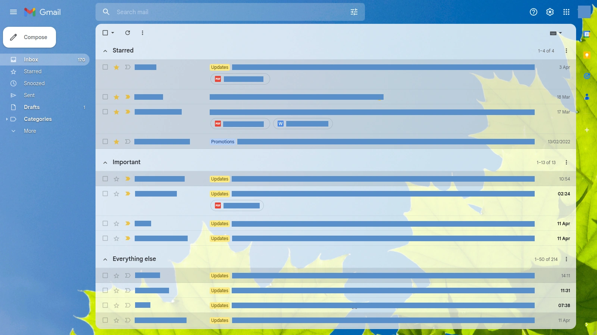
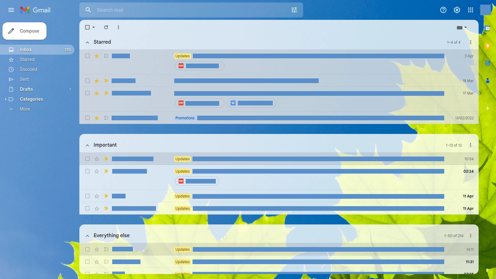

# Userscript: Fix Gmail Priority Inbox

This is a Greasemonkey userscript to fix the UI for Gmail priority inbox. Google made a change in recent years that removed the visual separation between these inboxes. This userscript brings this back - I find having these inboxes separated increases clarity and readability.

[See example screenshots.](#screenshots)

## Install

This userscript is available on Greasy Fork and OpenUserJS:

 

## Screenshots

Before:

After:

